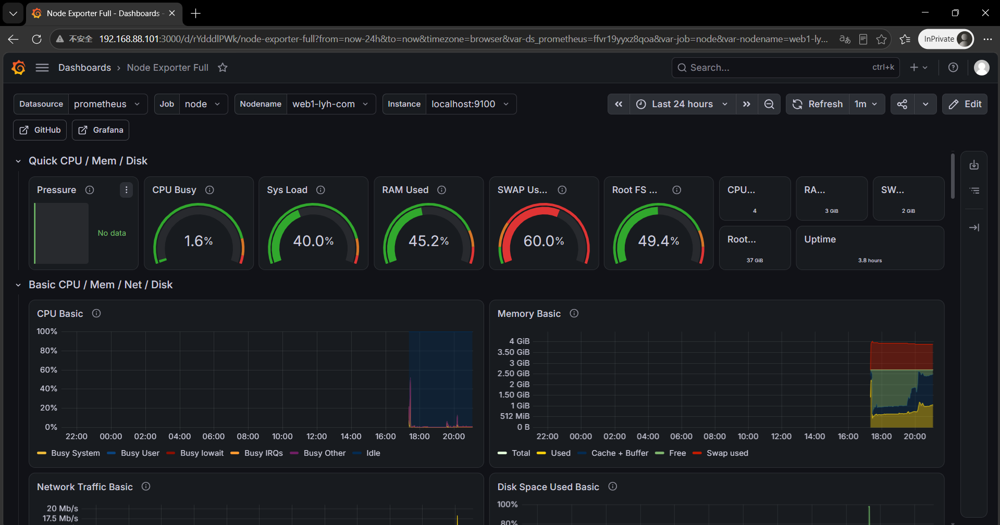

# prometheus-grafana-monitor
Prometheus+Grafana主机监控项目，实现服务器CPU/内存/磁盘/网络监控，记录部署踩坑全过程

# Prometheus + Grafana 服务器监控项目
> 实验环境：CentOS Stream 9
> 项目二：实现Linux主机系统指标监控（CPU、内存、磁盘、网络、系统负载）

## 📌项目简介
本项目基于Prometheus时序数据库 + Grafana可视化平台，使用node_exporter采集Linux服务器硬件与系统指标，完成服务器监控可视化。
- Prometheus：时序数据采集存储
- node_exporter：Linux主机指标采集器，暴露9100端口metrics
- Grafana：数据可视化仪表盘，导入1860模板展示主机监控大屏

## ✨实现功能
1. 采集服务器CPU使用率、内存、磁盘空间、网络流量、系统负载、开机时间
2. Grafana可视化大屏展示监控指标
3. 可扩展：支持监控MySQL/MariaDB、服务端口探测、告警

## 🛠环境信息
- OS：CentOS Stream 9
- Prometheus：2.53
- Grafana：最新开源版
- node_exporter：1.8
- 虚拟机IP：192.168.88.101

## 📂文档目录
- [部署详细步骤](./docs/deploy.md)
- [踩坑记录&问题排查](./docs/pit.md)
- [配置文件参考](./config/prometheus.yml)

## 🖼项目效果截图

## 📝学习总结
> 项目反思：不要仅仅复制命令搭建环境，要理解每个组件作用；
> prometheus采用pull拉取模式，exporter负责暴露metrics指标，prometheus定时拉取；
> Grafana只做可视化，不存储监控数据，数据全部保存在Prometheus。
